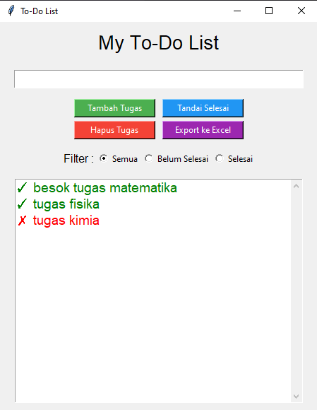

# 📝 To-Do List CLI (Python)


Aplikasi **To-Do List berbasis Command Line Interface (CLI)** yang
ringan dan mudah digunakan.\
Project ini dibuat menggunakan **Python** tanpa library tambahan
sehingga bisa berjalan di semua perangkat.

------------------------------------------------------------------------

## ✨ Fitur Utama

-   ➕ Tambah tugas baru\
-   📋 Lihat daftar tugas\
-   ✏️ Edit tugas\
-   ❌ Hapus tugas\
-   ☑️ Tandai tugas selesai\
-   💾 Data tersimpan otomatis (JSON file)

------------------------------------------------------------------------

## 📸 Screenshot

> *(Ganti file `screenshot.png` sesuai milikmu)*



------------------------------------------------------------------------

## 📦 Instalasi & Menjalankan Project

### 1️⃣ Clone / Download Project

Jika menggunakan Git:

``` bash
git clone https://github.com/yourusername/todo-cli.git
cd todo-cli
```

Jika download ZIP:\
Ekstrak ZIP → buka folder project.

------------------------------------------------------------------------

### 2️⃣ (Opsional) Buat Virtual Environment

``` bash
python -m venv venv
```

Aktifkan env:

**Windows**

``` bash
venv\Scriptsctivate
```

**Linux / Mac**

``` bash
source venv/bin/activate
```

------------------------------------------------------------------------

### 3️⃣ Jalankan Program

``` bash
python main.py
```

------------------------------------------------------------------------

## 📁 Struktur Project

    todo-cli/
    │── data.json        # Penyimpanan data tugas
    │── main.py          # Program utama
    │── modules/
    │     ├── menu.py    # Menu interaktif
    │     └── todos.py   # Fungsi CRUD
    │── README.md

------------------------------------------------------------------------

## 🛠 Teknologi yang Digunakan

-   Python Standard Library
    -   json\
    -   os\
    -   datetime

------------------------------------------------------------------------

## 🤝 Kontribusi

Pull request sangat diterima!\
Jika kamu ingin menambah fitur --- silakan buat branch baru.

------------------------------------------------------------------------

## 📄 License

Project ini menggunakan **MIT License**.

------------------------------------------------------------------------

## ✨ Author

**yourusername**\
Jika suka project ini, jangan lupa ⭐ di GitHub!
